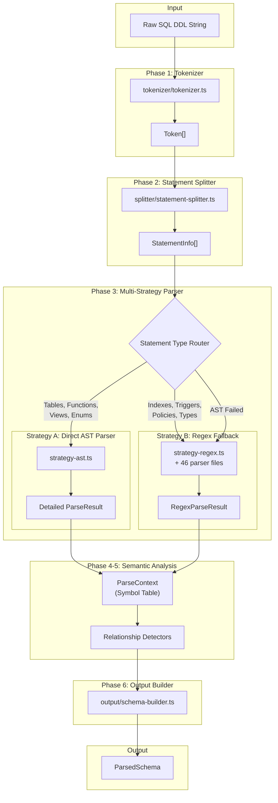
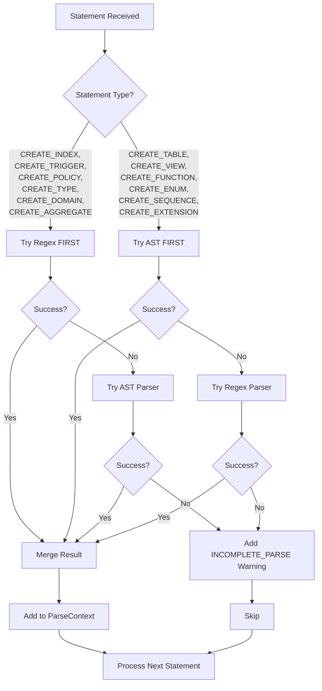

# Schema Weaver SQL Parser v4 — Architecture Documentation

> **Version**: 4.0  
> **Last Updated**: January 2026  
> **PostgreSQL Support**: PG12–PG19  
> **Test Status**: 378 tests, 100% pass rate  
> **Performance**: Processes 3,373 statements across 15 brutal SQL fixtures

---

## 1. Overview

The Schema Weaver PostgreSQL DDL Parser v4 transforms raw PostgreSQL `CREATE`/`ALTER`/`DROP` SQL statements into a structured `ParsedSchema` object model. It is designed for schema visualization, migration planning, and AI-powered schema analysis.

### What It Does

- **Parses DDL**: Extracts structured metadata from `CREATE TABLE`, `CREATE VIEW`, `CREATE FUNCTION`, `CREATE INDEX`, `CREATE TRIGGER`, `CREATE POLICY`, `CREATE TYPE`, `CREATE DOMAIN`, `CREATE SEQUENCE`, `CREATE EXTENSION`, `CREATE SCHEMA`, `CREATE ROLE`, `CREATE RULE`, `CREATE AGGREGATE`, `CREATE PROPERTY GRAPH`, and 35+ `DROP` statement types.
- **Detects Relationships**: Identifies foreign keys, partition hierarchies, inheritance, view dependencies, trigger bindings, and property graph edges.
- **Builds Semantic Model**: Produces a typed `ParsedSchema` with full metadata, statistics, and confidence scores.

### What It Does NOT Do

- **DML Parsing**: Does not parse `SELECT`, `INSERT`, `UPDATE`, `DELETE` (except when embedded in view definitions or function bodies).
- **Query Execution**: Does not validate SQL against a live database.
- **PL/pgSQL Execution**: Function/procedure bodies are captured as strings, not interpreted.
- **Data Extraction**: No table data is read or processed.

### Design Principles

- **Zero Runtime Dependencies**: Pure TypeScript, runs in browser and Node.js.
- **Multi-Strategy Parsing**: AST-first with regex fallback for error recovery.
- **Graceful Degradation**: Partial output on malformed SQL; never throws on recoverable errors.
- **Version-Aware**: Handles version-specific syntax (PG12–PG19) gracefully.

---

## 2. High-Level Architecture



---

## 3. Pipeline Deep Dive

### Phase 1: Tokenizer (`tokenizer/tokenizer.ts`)

**Purpose**: Convert raw SQL string into a stream of typed tokens.

**Input**: Raw SQL string (potentially unbalanced, with comments, dollar quotes)

**Output**: `Token[]` array

**How It Works**:

1. Character-by-character state machine
2. Tracks nesting depth (parentheses, brackets, braces)
3. Recognizes PostgreSQL-specific constructs:
   - Dollar-quoted strings: `$$ body $$` or `$tag$ body $tag$`
   - Nested block comments: `/* ... /* inner */ ... */`
   - Multi-character operators: `::`, `->>`, `!~*`

**Token Types**:

| Type | Example | Description |
|------|---------|-------------|
| `KEYWORD` | `CREATE`, `TABLE`, `PRIMARY` | Reserved SQL keywords |
| `IDENTIFIER` | `users`, `my_table` | Unquoted identifiers |
| `QUOTED_IDENTIFIER` | `"MyTable"` | Double-quoted identifiers |
| `STRING` | `'hello'` | Single-quoted string literals |
| `DOLLAR_STRING` | `$$ body $$` | Dollar-quoted function bodies |
| `NUMBER` | `123`, `3.14`, `1e10` | Numeric literals |
| `OPERATOR` | `+`, `::`, `->>` | SQL operators |
| `SYMBOL` | `(`, `)`, `,`, `.` | Punctuation |
| `COMMENT` | `-- comment`, `/* block */` | Comments (preserved or filtered) |

**Edge Cases Handled**:

- Unclosed quotes throw error with line/column
- Dollar-quoted strings are atomic (contents not tokenized)
- Nested comments tracked via depth counter

---

### Phase 2: Statement Splitter (`splitter/statement-splitter.ts`)

**Purpose**: Split token stream into individual SQL statements, respecting procedural code boundaries.

**Input**: `Token[]` from tokenizer

**Output**: `StatementInfo[]` — each with `text`, `type`, `tokens`, `namespace`, `dependencies`, `position`

**How It Works**:

1. Track parenthesis depth `(...)`
2. Track `BEGIN ATOMIC ... END` blocks (PG14+ function syntax)
3. Respect dollar-quoted regions (opaque content)
4. Split on `;` only when depth === 0
5. Identify statement type via keyword pattern matching
6. Extract namespace (schema.objectName) and dependencies upfront

**Statement Identification**:

```typescript
// Pattern matching on first 6 keywords:
'CREATE TABLE' → 'CREATE_TABLE'
'CREATE TABLE ... PARTITION OF' → 'CREATE_TABLE_PARTITION'
'CREATE OR REPLACE FUNCTION' → 'CREATE_FUNCTION'
'CREATE UNIQUE INDEX' → 'CREATE_INDEX'
'ALTER TABLE' → 'ALTER_TABLE'
// ... 60+ statement types
```

**Dependency Extraction**:

- `REFERENCES table(col)` → foreign key dependency
- `PARTITION OF parent` → partition parent dependency
- `INHERITS (parent)` → inheritance dependency
- `EXECUTE FUNCTION func()` → function call dependency

---

### Phase 3: Multi-Strategy Parser

The core innovation: two complementary parsing strategies that compensate for each other's weaknesses.

#### Strategy A: Direct AST Parser (`strategies/strategy-ast.ts`)

**Purpose**: Comprehensive regex-based parsing for standard DDL patterns.

**Input**: Single `StatementInfo` with cleaned SQL text

**Output**: `AstParseResult` with arrays of parsed objects

**How It Works**:

1. Clean SQL (remove comments, normalize whitespace)
2. Switch on `statement.type`
3. Dispatch to specialized parser function
4. Extract all fields from matched patterns
5. Build typed output objects

**Strengths**:

- Handles all standard PostgreSQL DDL
- Comprehensive field extraction
- Good for complex nested structures

**Weaknesses**:

- May fail on malformed SQL
- Lower confidence on complex parameter parsing (0.75 for functions)

**Statement Types Handled by AST Strategy**:

| Type | Confidence | Notes |
|------|------------|-------|
| `CREATE_TABLE` | 0.90 | Handles partitioning, inheritance, temporal |
| `CREATE_VIEW` | 0.90 | Supports recursive, materialized, security options |
| `CREATE_INDEX` | 0.95 | Partial indexes, covering, operator classes |
| `CREATE_FUNCTION` | 0.75 | Complex parameter parsing |
| `CREATE_TRIGGER` | 0.85 | Transition tables, WHEN conditions |
| `CREATE_ENUM` | 0.95 | Simple pattern |
| `CREATE_TYPE` | 0.90 | Composite, multirange |
| `CREATE_DOMAIN` | 0.90 | Check constraints, default |
| `CREATE_SEQUENCE` | 0.95 | All options |
| `CREATE_EXTENSION` | 1.00 | Very simple |
| `CREATE_SCHEMA` | 1.00 | Very simple |

#### Strategy B: Regex Fallback (`strategies/strategy-regex.ts`)

**Purpose**: Pattern-based parsing for specialized syntax and error recovery.

**Input**: Single `StatementInfo`

**Output**: `RegexParseResult`

**How It Works**:

1. Switch on `statement.type`
2. Try specialized regex parser
3. If type is `UNKNOWN`, autodetect by SQL text patterns
4. Return first successful match

**When Regex Is Preferred**:

```typescript
const regexFirstTypes = [
    'CREATE_INDEX',      // Partial indexes, COVERING
    'CREATE_TRIGGER',    // Complex REFERENCING
    'CREATE_POLICY',     // Complex USING/WITH CHECK
    'CREATE_TYPE',       // ENUM, composite
    'CREATE_DOMAIN',     // Custom constraints
    'CREATE_AGGREGATE',  // Specialized syntax
];
```

**Strengths**:

- Robust against syntax variations
- Can extract data from malformed SQL
- Easy to extend for new syntax

**Weaknesses**:

- May be fooled by deeply nested structures
- Some patterns capture names but lose details

**Lossy Parsing Warning**:

> ⚠️ Some regex fallback patterns capture only object names without full options. For example, a malformed `CREATE INDEX` may be detected but its `WHERE` clause lost. Always check `result.confidence` and `result.errors`.

---

### Phase 4: Relationship Detector (`relationships/`)

**Purpose**: Build the relationship graph between parsed objects.

**Input**: `ParseContext` with all parsed objects

**Output**: `Relationship[]` added to context

**Relationship Types Detected**:

| Type | Source | Target | Detection Method |
|------|--------|--------|-----------------|
| `FOREIGN_KEY` | Column | Column | Explicit `REFERENCES` |
| `PARTITION_CHILD` | Table | Table | `PARTITION OF` clause |
| `PARTITION_PARENT` | Table | Table | Reverse of above |
| `INHERITANCE` | Table | Table | `INHERITS` clause |
| `VIEW_DEPENDENCY` | View | Table | Query analysis |
| `TRIGGER_TARGET` | Trigger | Table | `ON table` clause |
| `TRIGGER_FUNCTION` | Trigger | Function | `EXECUTE FUNCTION` |
| `POLICY_TARGET` | Policy | Table | `ON table` clause |
| `PROPERTY_GRAPH_VERTEX` | PropertyGraph | Table | Vertex table mapping |
| `PROPERTY_GRAPH_EDGE` | PropertyGraph | Table | Edge table mapping |
| `TEMPORAL_FK` | Column | Column | PERIOD FK constraints |

**Detection Modules**:

- `fk-detector.ts` — Foreign key relationships
- `partition-detector.ts` — Parent-child partition hierarchies
- `inheritance-detector.ts` — Table inheritance
- `view-dependencies.ts` — View→table dependencies via query analysis
- `trigger-bindings.ts` — Trigger→table→function bindings
- `sequence-ownership.ts` — Sequence→column ownership
- `property-graph-relations.ts` — Graph→vertex/edge tables
- `temporal-relations.ts` — PERIOD constraint relationships

---

### Phase 5: Output Builder (`output/schema-builder.ts`)

**Purpose**: Assemble final `ParsedSchema` from all parsed objects.

**Input**: `ParseContext` with all collected objects

**Output**: Complete `ParsedSchema`

**How It Works**:

1. Inherit columns for child partitions (if missing)
2. Generate implicit indexes for PK/UNIQUE constraints
3. Build all relationships
4. Calculate statistics (`PostgresStats`)
5. Collect errors and warnings
6. Calculate overall confidence score

**Output Structure**:

```typescript
interface ParsedSchema {
    tables: Table[];
    relationships: Relationship[];
    enums: Map<string, string[]>;
    enumTypes: EnumType[];
    views: View[];
    triggers: Trigger[];
    indexes: Index[];
    sequences: Sequence[];
    functions: PostgresFunction[];
    policies: Policy[];
    extensions: Extension[];
    schemas: string[];
    domains: Domain[];
    compositeTypes: CompositeType[];
    roles: Role[];
    rules: Rule[];
    aggregates: Aggregate[];
    propertyGraphs: PropertyGraph[];
    stats: PostgresStats;
    errors: ParserError[];
    warnings: ParserError[];
    parseTime?: number;
    confidence: number;
}
```

---

## 4. Individual Parsers

### Core Table Parser (`parsers/table-parser.ts`)

**Statement Types**: `CREATE TABLE`, `CREATE TABLE AS SELECT`, `PARTITION OF`

**Fields Extracted**:

- `name`, `schema` — Table identity
- `columns[]` — Column definitions with all options
- `isPartitioned`, `partitionType`, `partitionKey` — Partitioning
- `partitionOf`, `partitionBounds` — Child partition metadata
- `inherits[]` — Parent tables
- `isTemporary`, `isUnlogged` — Storage options
- `primaryKey` — Table-level PK constraint
- `foreignKeys[]` — FK constraints
- `checkConstraints[]`, `uniqueConstraints[]` — Other constraints
- `period` — Temporal PERIOD clause (PG18)
- `withSystemVersioning` — SYSTEM VERSIONING (PG18)
- `rlsEnabled` — Row-level security flag
- `with{}` — Storage parameters

**Example Input**:

```sql
CREATE TABLE orders (
    id SERIAL PRIMARY KEY,
    user_id UUID NOT NULL REFERENCES users(id) ON DELETE CASCADE,
    status VARCHAR(30) DEFAULT 'pending',
    created_at TIMESTAMPTZ DEFAULT NOW()
) PARTITION BY RANGE (created_at);
```

**Example Output Fragment**:

```typescript
{
  name: 'orders',
  schema: 'public',
  columns: [
    { name: 'id', type: 'serial', isPrimaryKey: true, nullable: false },
    { name: 'user_id', type: 'uuid', nullable: false, isForeignKey: true,
      references: { table: 'users', column: 'id', onDelete: 'CASCADE' } },
    { name: 'status', type: 'varchar(30)', defaultValue: "'pending'" },
    { name: 'created_at', type: 'timestamptz', defaultValue: 'NOW()' }
  ],
  isPartitioned: true,
  partitionType: 'range',
  partitionKey: ['created_at']
}
```

**Known Limitations**:

- Confidence 0.8-0.85 due to regex complexity
- `CREATE TABLE OF type_name` (typed tables) parsed but type link not validated

---

### View Parser (`parsers/view-parser.ts`) — ⚠️ CATCH-ALL FALLBACK

> **WARNING**: Do NOT modify this file directly. It handles 100+ statement types as a fallback and breaks cascading tests if changed improperly.

**Statement Types**: `CREATE VIEW`, `CREATE MATERIALIZED VIEW`

**Fields Extracted**:

- `name`, `schema`
- `isMaterialized`, `isRecursive`
- `query` — Everything after `AS`
- `columns[]` — Column list if specified
- `checkOption` — `LOCAL` or `CASCADED`
- `securityBarrier`, `securityInvoker`
- `tablespace`, `accessMethod`

**Critical Behavior**:

The view parser is the **terminal fallback** for any statement that doesn't match other parsers. If you add a new parser, ensure it runs BEFORE view parser, or the view parser will incorrectly consume those statements.

---

### Index Parser (`parsers/index-parser.ts`)

**Statement Types**: `CREATE INDEX`, `CREATE UNIQUE INDEX`, `CREATE INDEX CONCURRENTLY`

**Fields Extracted**:

- `name`, `schema`, `table`
- `columns[]` — With `order`, `nulls`, `collation`, `operatorClass`
- `type` — `btree`, `hash`, `gin`, `gist`, `spgist`, `brin`
- `isUnique`, `isPartial`, `concurrently`
- `whereClause` — Partial index condition
- `includeColumns[]` — Covering index columns (PG12+)
- `with{}` — Storage parameters
- `nullsOrder` — NULLS FIRST/LAST

**PG15+ Support**: `NULLS NOT DISTINCT` for unique indexes

---

### Function Parser (`parsers/function-parser.ts`)

**Statement Types**: `CREATE FUNCTION`, `CREATE OR REPLACE FUNCTION`, `CREATE PROCEDURE`

**Fields Extracted**:

- `name`, `schema`
- `parameters[]` — `{name, type, mode, default}`
- `returnType` — Including `SETOF`, `TABLE(...)`
- `language` — `sql`, `plpgsql`, etc.
- `body` — Dollar-quoted function body
- `sqlBody` — PG14+ inline `RETURN expr` syntax
- `volatility` — `IMMUTABLE`, `STABLE`, `VOLATILE`
- `securityDefiner` — Boolean
- `parallel` — `SAFE`, `RESTRICTED`, `UNSAFE`
- `cost`, `rows` — Planner hints
- `setOptions[]` — `SET` configuration parameters

**Known Limitations**:

- Confidence 0.75 — parameter parsing is complex
- Named parameter syntax (`name := value`) not fully supported

---

### Trigger Parser (`parsers/trigger-parser.ts`)

**Statement Types**: `CREATE TRIGGER`, `CREATE CONSTRAINT TRIGGER`

**Fields Extracted**:

- `name`, `table`
- `timing` — `BEFORE`, `AFTER`, `INSTEAD OF`
- `events[]` — `INSERT`, `UPDATE`, `DELETE`, `TRUNCATE`
- `level` — `ROW` or `STATEMENT`
- `functionName`, `functionSchema`
- `condition` — `WHEN` clause
- `referencing` — Transition tables (PG10+)
- `arguments[]` — Passed to trigger function
- `isConstraint`, `deferrable`, `initiallyDeferred`

---

### Policy Parser (`parsers/policy-parser.ts` + `policy-extended-parser.ts`)

**Statement Types**: `CREATE POLICY`

**Fields Extracted**:

- `name`, `table`, `schema`
- `permissive` — `PERMISSIVE` or `RESTRICTIVE`
- `command` — `ALL`, `SELECT`, `INSERT`, `UPDATE`, `DELETE`
- `roles[]` — Applicable roles
- `usingExpression` — `USING` clause
- `checkExpression` — `WITH CHECK` clause

**Edge Cases**:

- `extractBalancedParentheses` handles nested expressions in USING/WITH CHECK

---

### Enum Parser (`parsers/enum-parser.ts`)

**Statement Types**: `CREATE TYPE ... AS ENUM`

**Fields Extracted**:

- `name`, `schema`
- `values[]` — Enum values

---

### Composite Type Parser (`parsers/type-parser.ts`)

**Statement Types**: `CREATE TYPE ... AS (...)`, `CREATE TYPE ... AS MULTIRANGE`

**Fields Extracted**:

- `name`, `schema`
- `attributes[]` — `{name, type}` for composite
- `kind` — `composite`, `multirange`, `range`
- `subtype` — For range/multirange types

---

### Domain Parser (`parsers/domain-parser.ts`)

**Statement Types**: `CREATE DOMAIN`

**Fields Extracted**:

- `name`, `schema`, `baseType`
- `notNull`, `default`, `checkExpression`, `collation`

---

### Sequence Parser (`parsers/sequence-parser.ts` + `sequence-extended-parser.ts`)

**Statement Types**: `CREATE SEQUENCE`

**Fields Extracted**:

- `name`, `schema`
- `dataType` — `SMALLINT`, `INTEGER`, `BIGINT`
- `start`, `increment`, `minValue`, `maxValue`
- `cycle`, `cache`, `order`
- `ownedBy`

---

### Property Graph Parser (`parsers/property-graph-parser.ts`)

**Statement Types**: `CREATE PROPERTY GRAPH` (PG19 SQL/PGQ)

**Fields Extracted**:

- `name`, `schema`
- `vertices[]` — `{name, table, idExpression, properties}`
- `edges[]` — `{name, table, sourceExpression, targetExpression, properties}`

**Side Effects**:

- Marks referenced tables with `isVertex`, `isEdge`, `graphLabel`

---

### ALTER Table Parser (`parsers/alter-table-parser.ts`)

**Statement Types**: 50+ `ALTER TABLE` sub-commands

**Sub-Commands Handled**:

| Category | Commands |
|----------|----------|
| Columns | `ADD COLUMN`, `DROP COLUMN`, `ALTER COLUMN`, `RENAME COLUMN` |
| Constraints | `ADD CONSTRAINT`, `DROP CONSTRAINT`, `VALIDATE CONSTRAINT` |
| Partitioning | `ATTACH PARTITION`, `DETACH PARTITION`, `MERGE PARTITIONS`, `SPLIT PARTITION` |
| Storage | `SET TABLESPACE`, `SET SCHEMA`, `SET ACCESS METHOD` |
| Security | `ENABLE ROW LEVEL SECURITY`, `FORCE ROW LEVEL SECURITY` |
| Inheritance | `INHERIT`, `NO INHERIT` |
| PG18/19 | `SET VARIANT`, `DROP VARIANT`, `SET EXPRESSION`, `DROP EXPRESSION` |

---

### DROP Statement Parsers (`parsers/drop-parser.ts`)

**Statement Types**: 35+ `DROP` variants

All drop parsers follow the same pattern:

```typescript
interface DropResult {
    type: 'DROP_*';
    name: string;
    schema?: string;
    ifExists: boolean;
    cascade: boolean;
}
```

**DROP Types Supported**:

- `DROP TABLE`, `DROP VIEW`, `DROP INDEX`, `DROP FUNCTION`
- `DROP TYPE`, `DROP DOMAIN`, `DROP SEQUENCE`, `DROP SCHEMA`
- `DROP EXTENSION`, `DROP TRIGGER`, `DROP POLICY`, `DROP RULE`
- `DROP ROLE`, `DROP AGGREGATE`, `DROP OPERATOR`, `DROP COLLATION`
- `DROP PROPERTY GRAPH`, `DROP MATERIALIZED VIEW`
- `DROP CAST`, `DROP CONVERSION`, `DROP TRANSFORM`
- `DROP FOREIGN TABLE`, `DROP SERVER`, `DROP USER MAPPING`
- `DROP STATISTICS`, `DROP EVENT TRIGGER`
- `DROP SUBSCRIPTION`, `DROP PUBLICATION`
- `DROP FOREIGN DATA WRAPPER`, `DROP LARGE OBJECT`
- `DROP TEXT SEARCH DICTIONARY/CONFIGURATION/PARSER/TEMPLATE`

---

### Extended Parsers

Many parsers have `-extended` variants with enhanced extraction:

| Parser | Extended Features |
|--------|-------------------|
| `view-extended-parser.ts` | Column list, WITH options, better query extraction |
| `function-extended-parser.ts` | `strict`, transforms, window/aggregate flags |
| `trigger-extended-parser.ts` | ORDER clause, FILTER condition, transition tables |
| `policy-extended-parser.ts` | Full USING/WITH CHECK expression parsing |
| `sequence-extended-parser.ts` | All sequence options |
| `index-extended-parser.ts` | Passthrough to index-parser (consistency) |
| `role-extended-parser.ts` | IN ROLE, ROLE, ADMIN memberships, SETTINGS |
| `schema-extended-parser.ts` | AUTHORIZATION, charset, collation |

---

### Additional Parsers

| File | Statement Type | Key Fields |
|------|---------------|------------|
| `extension-parser.ts` | `CREATE EXTENSION` | name, schema, version |
| `role-parser.ts` | `CREATE ROLE`/`USER` | isSuperuser, canLogin, bypassRls |
| `rule-parser.ts` | `CREATE RULE` | event, condition, action |
| `aggregate-parser.ts` | `CREATE AGGREGATE` | sfunc, stype, finalFunc |
| `operator-parser.ts` | `CREATE OPERATOR` | leftType, rightType, procedure |
| `database-parser.ts` | `CREATE DATABASE` | owner, template, encoding |
| `collation-parser.ts` | `CREATE COLLATION` | provider, locale |
| `stats-parser.ts` | `CREATE STATISTICS` | columns, kind, target |
| `materialized-view-parser.ts` | `CREATE MATERIALIZED VIEW` | query, withNoData |
| `temporal-parser.ts` | PERIOD/SYSTEM_VERSIONING | startColumn, endColumn |
| `partition-parser.ts` | PARTITION OF | parentTable, bounds |

---

## 5. ParsedSchema Output — Complete Type Reference

### Top-Level Schema

```typescript
interface ParsedSchema {
    tables: Table[];
    relationships: Relationship[];
    enums: Map<string, string[]>;
    enumTypes: EnumType[];
    views: View[];
    triggers: Trigger[];
    indexes: Index[];
    sequences: Sequence[];
    functions: PostgresFunction[];
    policies: Policy[];
    extensions: Extension[];
    schemas: string[];
    domains: Domain[];
    compositeTypes: CompositeType[];
    roles: Role[];
    rules: Rule[];
    aggregates?: Aggregate[];
    propertyGraphs?: PropertyGraph[];
    stats: PostgresStats;
    errors: ParserError[];
    warnings: ParserError[];
    parseTime?: number;
    confidence: number;
}
```

### Table

```typescript
interface Table {
    name: string;
    schema?: string;
    columns: Column[];
    isPartitioned: boolean;
    partitionType?: 'range' | 'list' | 'hash';
    partitionKey?: string[];
    partitionOf?: string;
    partitionBounds?: PartitionBounds;
    inheritsFrom?: string;
    inherits?: string[];
    isTemporary: boolean;
    isUnlogged: boolean;
    checkConstraints: NamedConstraint[];
    uniqueConstraints: NamedConstraint[];
    primaryKey?: TableLevelPrimaryKey;
    foreignKeys: TableLevelForeignKey[];
    constraints?: any[];
    comment?: string;
    confidence: number;
    verificationLevel?: 'DEFINITIVE' | 'HEURISTIC' | 'INFERRED';
    rlsEnabled?: boolean;
    
    // PG18 Temporal
    temporalConstraints?: TemporalConstraint[];
    period?: TemporalPeriod;
    withoutOverlaps?: boolean;
    withSystemVersioning?: boolean;
    
    // PG19 Property Graph
    isVertex?: boolean;
    isEdge?: boolean;
    isPropertyGraphVertex?: boolean;
    isPropertyGraphEdge?: boolean;
    graphLabel?: string;
    graphName?: string;
    
    // Storage
    with?: Record<string, string | number>;
    accessMethod?: string;
    tablespace?: string;
    partitionTablespace?: string;
    onCommit?: 'PRESERVE_ROWS' | 'DELETE_ROWS' | 'DROP';
    
    // CTAS
    createAs?: boolean;
    asQuery?: string;
    
    // Other
    withOids?: boolean;
    withoutOids?: boolean;
    likeTable?: string;
    ofType?: string;
    temporary?: 'LOCAL' | 'GLOBAL';
}
```

### Column

```typescript
interface Column {
    name: string;
    type: string;
    typeCategory: DataTypeCategory;
    nullable: boolean;
    isPrimaryKey?: boolean;
    isForeignKey?: boolean;
    isUnique?: boolean;
    isGenerated?: boolean;
    generatedExpression?: string;
    generatedType?: 'STORED' | 'VIRTUAL' | 'ALWAYS_IDENTITY' | 'BY_DEFAULT_IDENTITY';
    defaultValue?: string;
    checkConstraint?: string;
    references?: ForeignKeyReference;
    comment?: string;
    
    // PG18 Named NOT NULL
    notNullConstraint?: {
        name?: string;
        notValid?: boolean;
        inherited?: boolean;
    };
    
    // PG12+ Identity
    identityOptions?: {
        always: boolean;
        startWith?: number;
        incrementBy?: number;
        minValue?: number;
        maxValue?: number;
        cache?: number;
        cycle?: boolean;
    };
    
    // Collation
    collation?: string;
}
```

### DataTypeCategory

```typescript
type DataTypeCategory =
    | 'numeric'    // int, bigint, serial, decimal, numeric
    | 'text'       // varchar, char, text
    | 'boolean'    // bool, boolean
    | 'datetime'   // timestamp, date, time, interval
    | 'uuid'       // uuid
    | 'json'       // json, jsonb
    | 'array'      // type[]
    | 'binary'     // bytea
    | 'range'      // int4range, etc.
    | 'network'    // inet, cidr, macaddr
    | 'geometry'   // point, geometry
    | 'hstore'     // hstore
    | 'other';     // catch-all
```

### Index

```typescript
interface Index {
    name: string;
    schema?: string;
    table: string;
    columns: IndexColumn[];
    type: 'btree' | 'hash' | 'gin' | 'gist' | 'spgist' | 'brin';
    method: string;
    isUnique: boolean;
    isPartial: boolean;
    whereClause?: string;
    includeColumns: string[];
    with?: IndexWithOptions;
    accessMethod?: string;
    operatorClasses?: IndexOperatorClass[];
    collation?: string[];
    nullsOrder?: ('FIRST' | 'LAST')[];
    concurrently?: boolean;
    ifNotExists?: boolean;
}

interface IndexColumn {
    column: string;
    name?: string;
    order?: 'ASC' | 'DESC';
    direction?: 'ASC' | 'DESC';
    nulls?: 'FIRST' | 'LAST';
    operatorClass?: string;
    collation?: string;
}

interface IndexWithOptions {
    fillfactor?: number;
    vacuum_cleanup_index_scale_factor?: number;
    fastupdate?: boolean;
    gin_pending_list_limit?: number;
    deduplicate_items?: boolean;
    pages_per_range?: number;
    autosummarize?: boolean;
    [key: string]: string | number | boolean | undefined;
}
```

### View

```typescript
interface View {
    name: string;
    schema?: string;
    isMaterialized: boolean;
    isRecursive: boolean;
    query?: string;
    columns?: (string | ViewColumn)[];
    comment?: string;
    verificationLevel?: 'DEFINITIVE' | 'HEURISTIC' | 'INFERRED';
    definedOn?: string[];
    withOptions?: ViewWithOptions;
    checkOption?: 'LOCAL' | 'CASCADED';
    securityBarrier?: boolean;
    securityInvoker?: boolean;
    accessMethod?: string;
    tablespace?: string;
}
```

### Function

```typescript
interface PostgresFunction {
    name: string;
    schema?: string;
    language: string;
    returnType?: string;
    isProcedure: boolean;
    parameters?: FunctionParameter[];
    arguments?: FunctionParameter[];
    body?: string;
    volatility?: 'VOLATILE' | 'STABLE' | 'IMMUTABLE';
    securityDefiner?: boolean;
    setOptions?: FunctionSetOption[];
    cost?: number;
    rows?: number;
    parallel?: 'SAFE' | 'RESTRICTED' | 'UNSAFE';
    returnsNullOnNullInput?: boolean;
    strict?: boolean;
    transforms?: Transform[];
    windowFunc?: boolean;
    aggregate?: boolean;
    variadic?: 'ANY' | 'VARIADIC' | string;
    setReturning?: boolean;
    sqlBody?: string;
}

interface FunctionParameter {
    name?: string;
    type: string;
    mode?: 'IN' | 'OUT' | 'INOUT' | 'VARIADIC';
    default?: string;
    typeModifier?: number;
    collation?: string;
}
```

### Trigger

```typescript
interface Trigger {
    name: string;
    schema?: string;
    table: string;
    timing: 'BEFORE' | 'AFTER' | 'INSTEAD OF';
    events: string[];
    event?: string;
    level?: 'ROW' | 'STATEMENT';
    functionName?: string;
    functionSchema?: string;
    function?: string;
    condition?: string;
    transitionTables?: TriggerTransitionTable[];
    referencing?: {
        oldTable?: string;
        newTable?: string;
    };
    order?: { name: string; position: number };
    deferrable?: boolean;
    initiallyDeferred?: boolean;
    initially?: 'DEFERRED' | 'IMMEDIATE';
    filterCondition?: string;
    propertyGraph?: { type: 'VERTEX' | 'EDGE'; name?: string };
    arguments?: string[];
    isConstraint?: boolean;
}
```

### Policy

```typescript
interface Policy {
    name: string;
    schema?: string;
    table: string;
    command?: 'ALL' | 'SELECT' | 'INSERT' | 'UPDATE' | 'DELETE';
    cmd?: 'ALL' | 'SELECT' | 'INSERT' | 'UPDATE' | 'DELETE';
    permissive: boolean | 'PERMISSIVE' | 'RESTRICTIVE';
    roles?: string[];
    usingExpression?: string;
    checkExpression?: string;
    using?: string;
    withCheck?: string;
    bypassRls?: boolean;
    checkOption?: 'LOCAL' | 'CASCADED';
}
```

### Enum

```typescript
interface EnumType {
    name: string;
    schema?: string;
    values: string[];
}
```

### Composite Type

```typescript
interface CompositeType {
    name: string;
    schema?: string;
    attributes: CompositeTypeAttribute[];
    fields?: { name: string; type: string }[];
    columns?: { name: string; type: string }[];
    kind?: 'composite' | 'multirange' | 'range';
    subtype?: string;
}
```

### Domain

```typescript
interface Domain {
    name: string;
    schema?: string;
    baseType: string;
    notNull?: boolean;
    default?: string;
    checkExpression?: string;
    constraints?: DomainConstraint[];
    collation?: string;
}
```

### Sequence

```typescript
interface Sequence {
    name: string;
    schema?: string;
    dataType?: string;
    start?: number;
    increment?: number;
    minValue?: number;
    maxValue?: number;
    cycle?: boolean;
    cache?: number;
    order?: boolean;
    ownedBy?: string;
    comment?: string;
    accessMethod?: string;
    with?: Record<string, string | number>;
    temporary?: boolean;
}
```

### Extension

```typescript
interface Extension {
    name: string;
    version?: string;
    schema?: string;
}
```

### Role

```typescript
interface Role {
    name: string;
    isSuperuser?: boolean;
    canLogin?: boolean;
    canCreateDb?: boolean;
    canCreateRole?: boolean;
    inherit?: boolean;
    bypassRls?: boolean;
    connectionLimit?: number;
    validUntil?: string;
    inRoles?: string[];
    roles?: string[];
    adminRoles?: string[];
    password?: string;
    login?: boolean;
    superuser?: boolean;
    createdb?: boolean;
    createrole?: boolean;
    replication?: boolean;
    bypassrls?: boolean;
    inRole?: string[];
    role?: string[];
    admin?: string[];
    settings?: RoleSetting[];
    memberOptions?: RoleMemberOption[];
}
```

### Rule

```typescript
interface Rule {
    name: string;
    schema?: string;
    table: string;
    event: 'SELECT' | 'INSERT' | 'UPDATE' | 'DELETE';
    instead?: boolean;
    condition?: string;
    action?: string | RuleAction[];
    isInstead?: boolean;
    whereClause?: string;
    priority?: number;
}
```

### Aggregate

```typescript
interface Aggregate {
    name: string;
    schema?: string;
    baseType?: string;
    finalFunc: string;
    initCond?: string;
    finalFuncExtra?: boolean;
    sortOperator?: string;
    combineFunc?: string;
    serializeFunc?: string;
    deserializeFunc?: string;
    msfunc?: string;
    minvfunc?: string;
    mfinalfunc?: string;
    minitcond?: string;
    mfinalfuncExtra?: boolean;
    mfinalfuncDirect?: boolean;
    hashable?: boolean;
}
```

### Property Graph (PG19)

```typescript
interface PropertyGraph {
    name: string;
    schema?: string;
    vertices?: PropertyGraphVertex[];
    edges?: PropertyGraphEdge[];
    keyType?: string;
    properties?: PropertyGraphProperty[];
}
```

### Relationship

```typescript
interface Relationship {
    id: string;
    source: { schema?: string; table: string; column?: string };
    target: { schema?: string; table: string; column?: string };
    type: RelationshipType;
    cardinality?: 'ONE_TO_ONE' | 'ONE_TO_MANY' | 'MANY_TO_ONE' | 'MANY_TO_MANY' | 'UNKNOWN';
    onDelete?: 'CASCADE' | 'SET NULL' | 'RESTRICT' | 'NO ACTION';
    onUpdate?: 'CASCADE' | 'SET NULL' | 'RESTRICT' | 'NO ACTION';
    sourceType?: 'EXPLICIT_FK' | 'INFERRED_VIEW' | 'INFERRED_TRIGGER' | 'PARSER_MATCH';
    confidence: number;
    metadata?: {
        isFuzzyMatch?: boolean;
        matchMethod?: 'regex' | 'ast' | 'parser_match';
        periodColumn?: string;
        targetTable?: string;
        targetColumns?: string[];
    };
}

type RelationshipType =
    | 'FOREIGN_KEY'
    | 'TEMPORAL_FK'
    | 'TEMPORAL_PK'
    | 'WITHOUT_OVERLAPS'
    | 'PERIOD'
    | 'PARTITION_CHILD'
    | 'PARTITION_PARENT'
    | 'VIEW_DEPENDENCY'
    | 'TRIGGER_TARGET'
    | 'TRIGGER_FUNCTION'
    | 'POLICY_TARGET'
    | 'CALLS'
    | 'DEPENDS_ON'
    | 'OWNS_POLICY'
    | 'APPLIES_TO'
    | 'HAS_SEQUENCE'
    | 'PROPERTY_GRAPH_VERTEX'
    | 'PROPERTY_GRAPH_EDGE'
    | 'PROPERTY_GRAPH_PATH'
    | 'INFERRED'
    | 'INHERITANCE';
```

### Statistics

```typescript
interface PostgresStats {
    dataTypes: Map<DataTypeCategory, number>;
    primaryKeys: number;
    foreignKeys: number;
    uniqueConstraints: number;
    checkConstraints: number;
    notNullConstraints: number;
    indexTypes: Map<string, number>;
    generatedColumns: number;
    defaultValues: number;
    partitionedTables: number;
    childPartitions: number;
    temporaryTables: number;
    inheritedTables: number;
    rlsPolicies: number;
    withoutOverlapsConstraints: number;
    periodTemporalConstraints: number;
    temporalTables: number;
}
```

### ParserError

```typescript
interface ParserError {
    level: 'ERROR' | 'WARNING' | 'SUGGESTION' | 'INFO';
    code: 'PARSE_ERROR' | 'TOKENIZE_ERROR' | 'FK_UNRESOLVED' | 'TYPE_UNKNOWN' 
        | 'TABLE_UNKNOWN' | 'SCHEMA_UNKNOWN' | 'CIRCULAR_DEPENDENCY' 
        | 'DUPLICATE_NAME' | 'CONSTRAINT_INVALID' | 'SYNTAX_ERROR' 
        | 'INCOMPLETE_PARSE' | 'UNEXPECTED_EOF' | 'UNEXPECTED_TOKEN';
    message: string;
    position?: Position;
    endPosition?: Position;
    statement?: string;
    suggestion?: string;
    recovery?: 'SKIP_TOKEN' | 'SKIP_STATEMENT' | 'SKIP_CONSTRUCT' | 'CONTINUE';
    affectedObject?: string;
}
```

---

## 6. Multi-Strategy Decision Flow



**Decision Logic** (from `index.ts:parseStatement`):

```typescript
const regexFirstTypes: StatementType[] = [
    'CREATE_INDEX',
    'CREATE_TRIGGER',
    'CREATE_POLICY',
    'CREATE_TYPE',
    'CREATE_DOMAIN',
    'CREATE_AGGREGATE',
];

if (regexFirstTypes.includes(stmt.type)) {
    // Try regex first for these types
    const regexResult = tryRegexParse(stmt, context);
    if (regexResult.success) {
        mergeRegexResult(regexResult, context);
        return;
    }
    // Fall back to AST
    const astResult = tryAstParse(stmt, context);
    if (astResult.success) {
        mergeAstResult(astResult, context);
        return;
    }
} else {
    // AST first
    const astResult = tryAstParse(stmt, context);
    if (astResult.success) {
        mergeAstResult(astResult, context);
        return;
    }
    // Regex fallback
    const regexResult = tryRegexParse(stmt, context);
    if (regexResult.success) {
        mergeRegexResult(regexResult, context);
        return;
    }
}

// Both failed - emit warning
context.addWarning({
    level: 'WARNING',
    code: 'INCOMPLETE_PARSE',
    message: `Could not parse statement: ${stmt.text.slice(0, 100)}...`,
});
```

---

## 7. PostgreSQL Version Feature Matrix

| Feature | PG12 | PG13 | PG14 | PG15 | PG16 | PG17 | PG18 | PG19 |
|---------|------|------|------|------|------|------|------|------|
| **Generated Columns (STORED)** | ✅ | ✅ | ✅ | ✅ | ✅ | ✅ | ✅ | ✅ |
| **Identity Columns** | ✅ | ✅ | ✅ | ✅ | ✅ | ✅ | ✅ | ✅ |
| **Covering Indexes (INCLUDE)** | ✅ | ✅ | ✅ | ✅ | ✅ | ✅ | ✅ | ✅ |
| **Extended Statistics** | ⚠️ | ✅ | ✅ | ✅ | ✅ | ✅ | ✅ | ✅ |
| **Partition Triggers** | ❌ | ✅ | ✅ | ✅ | ✅ | ✅ | ✅ | ✅ |
| **SQL Standard Function Bodies** | ❌ | ❌ | ✅ | ✅ | ✅ | ✅ | ✅ | ✅ |
| **DETACH PARTITION CONCURRENTLY** | ❌ | ❌ | ✅ | ✅ | ✅ | ✅ | ✅ | ✅ |
| **Multirange Types** | ❌ | ❌ | ✅ | ✅ | ✅ | ✅ | ✅ | ✅ |
| **Security Invoker Views** | ❌ | ❌ | ❌ | ✅ | ✅ | ✅ | ✅ | ✅ |
| **NULLS NOT DISTINCT** | ❌ | ❌ | ❌ | ✅ | ✅ | ✅ | ✅ | ✅ |
| **RLS on Partitioned Tables** | ❌ | ❌ | ❌ | ✅ | ✅ | ✅ | ✅ | ✅ |
| **Sequence Type Specification** | ❌ | ❌ | ❌ | ✅ | ✅ | ✅ | ✅ | ✅ |
| **REGROLE Defaults** | ❌ | ❌ | ❌ | ❌ | ✅ | ✅ | ✅ | ✅ |
| **JSON_TABLE / SQL:JSON** | ❌ | ❌ | ❌ | ❌ | ❌ | ✅ | ✅ | ✅ |
| **MERGE/SPLIT PartITIONS** | ❌ | ❌ | ❌ | ❌ | ❌ | ✅ | ✅ | ✅ |
| **Temporal Tables (PERIOD)** | ❌ | ❌ | ❌ | ❌ | ❌ | ❌ | ✅ | ✅ |
| **WITHOUT OVERLAPS Constraints** | ❌ | ❌ | ❌ | ❌ | ❌ | ❌ | ✅ | ✅ |
| **VIRTUAL Generated Columns** | ❌ | ❌ | ❌ | ❌ | ❌ | ❌ | ✅ | ✅ |
| **NOT ENFORCED Constraints** | ❌ | ❌ | ❌ | ❌ | ❌ | ❌ | ✅ | ✅ |
| **SYSTEM_VERSIONING** | ❌ | ❌ | ❌ | ❌ | ❌ | ❌ | ✅ | ✅ |
| **Property Graphs (SQL/PGQ)** | ❌ | ❌ | ❌ | ❌ | ❌ | ❌ | ❌ | ✅ |
| **NODE TABLES** | ❌ | ❌ | ❌ | ❌ | ❌ | ❌ | ❌ | ✅ |
| **GRAPH_TABLE Queries** | ❌ | ❌ | ❌ | ❌ | ❌ | ❌ | ❌ | ✅ |

**Legend**:
- ✅ **Fully Supported** — All fields extracted
- ⚠️ **Partially Supported** — Basic structure parsed, some fields missing
- ❌ **Not Supported** — Feature does not exist in that version

---

## 8. Error Handling

### Error Philosophy

The parser follows a **graceful degradation** model:

1. **Never throw on recoverable errors** — Return partial output with warnings
2. **Track all issues** — Every error/warning captured in `ParsedSchema.errors`/`warnings`
3. **Confidence scoring** — Each object has a 0.0-1.0 confidence score
4. **Recovery modes** — Skip token, skip statement, or continue parsing

### Error Levels

| Level | Meaning | Example |
|-------|---------|---------|
| `ERROR` | Parse failed for statement | Unrecognized statement type |
| `WARNING` | Partial parse, some fields missing | Regex fallback used |
| `SUGGESTION` | Non-critical issue | Unknown type name used |
| `INFO` | Debug information | Search path changed |

### Error Codes

| Code | Meaning |
|------|---------|
| `PARSE_ERROR` | General parsing failure |
| `TOKENIZE_ERROR` | Lexer failure (unclosed quote, etc.) |
| `FK_UNRESOLVED` | Foreign key references unknown table |
| `TYPE_UNKNOWN` | Column uses undefined type |
| `TABLE_UNKNOWN` | Reference to undefined table |
| `SCHEMA_UNKNOWN` | Reference to undefined schema |
| `CIRCULAR_DEPENDENCY` | Dependency cycle detected |
| `DUPLICATE_NAME` | Same object defined twice |
| `CONSTRAINT_INVALID` | Malformed constraint |
| `SYNTAX_ERROR` | SQL syntax violation |
| `INCOMPLETE_PARSE` | Parser couldn't extract all fields |
| `UNEXPECTED_EOF` | File ended mid-statement |
| `UNEXPECTED_TOKEN` | Token didn't match expected pattern |

### Checking Parse Quality

```typescript
const result = parsePostgresSQL(sql);

// 1. Check for critical errors
if (result.errors.filter(e => e.level === 'ERROR').length > 0) {
    console.error('Parse failed:', result.errors);
}

// 2. Check confidence
if (result.confidence < 0.8) {
    console.warn('Low confidence parse:', result.confidence);
}

// 3. Check warnings for partial parses
const partialParses = result.warnings.filter(w => w.code === 'INCOMPLETE_PARSE');
if (partialParses.length > 0) {
    console.warn('Some statements partially parsed:', partialParses);
}

// 4. Check individual object confidence
const lowConfidenceTables = result.tables.filter(t => t.confidence < 0.8);
if (lowConfidenceTables.length > 0) {
    console.warn('Low confidence tables:', lowConfidenceTables);
}
```

---

## 9. Performance Characteristics

### Time Complexity

| Phase | Complexity | Notes |
|-------|------------|-------|
| Tokenizer | O(n) | Single pass over SQL string |
| Statement Splitter | O(n) | Single pass over tokens |
| Parser | O(n × m) | n statements × m pattern matches per type |
| Relationship Builder | O(t²) | t tables for FK resolution |
| Output Builder | O(t + i + v) | Linear over all objects |

### Large Input Handling

**Default Limits** (configurable via `ParseOptions`):

```typescript
const DEFAULT_PARSE_OPTIONS = {
    maxStatements: 10000,  // Truncate beyond this
    // ...
};
```

**Memory Considerations**:

- Token stream: ~10 bytes per token
- ParseContext: Stores all objects in memory
- Peak memory: ~5-10× input SQL size

**Browser vs Node.js**:

- Both use same code path
- No platform-specific optimizations
- File reading in tests uses Node.js `fs` module

### Benchmarks

From stress tests:

| Fixture | Statements | Tables | Parse Time | Memory |
|---------|------------|--------|------------|--------|
| pg12-14-ecommerce.sql | ~800 | 37 | <500ms | <50MB |
| pg15-17-saas-platform.sql | ~1000 | 42 | <750ms | <75MB |
| pg18-19-temporal-graph.sql | ~1200 | 35 | <1000ms | <100MB |

---

## 10. Testing

### Test Structure

```
__tests__/
├── unit/               # Unit tests for individual components
│   └── rule-parser.test.ts
├── edge-cases/         # Edge case tests per feature area
│   ├── edge-alter-advanced.test.ts
│   ├── edge-functions-procedures.test.ts
│   ├── edge-indexes.test.ts
│   ├── edge-partitioning.test.ts
│   ├── edge-sequences.test.ts
│   ├── edge-security.test.ts
│   ├── edge-tables.test.ts
│   ├── edge-temporal.test.ts
│   ├── edge-triggers.test.ts
│   ├── edge-types.test.ts
│   ├── edge-views.test.ts
│   └── combined-stress.test.ts
├── e2e/                # End-to-end schema parsing
│   ├── e2e-ecommerce.test.ts
│   ├── e2e-saas.test.ts
│   └── e2e-temporal-graph.test.ts
├── stress/             # Performance and memory tests
│   ├── stress-parse.test.ts
│   ├── stress-correctness.test.ts
│   └── stress-relationships.test.ts
├── brutal/             # Hostile QA tests
│   ├── brutal-break.test.ts
│   ├── pg12-specific.sql
│   ├── pg13-specific.sql
│   ├── ...
│   └── pg19-specific.sql
├── benchmark/          # Performance benchmarks
│   └── benchmark.test.ts
├── fk-detector.test.ts
├── inheritance-detector.test.ts
├── partition-detector.test.ts
└── relationship-builder.test.ts
```

### Running Tests

```bash
# Run all tests
cd frontend
npm test

# Run specific test file
npx vitest run src/lib/sql-parser/__tests__/unit/rule-parser.test.ts

# Run brutal tests
npx vitest run src/lib/sql-parser/__tests__/brutal/brutal-break.test.ts

# Run with coverage
npm run test:coverage

# Watch mode
npm run test:watch
```

### Test Coverage

| Metric | Value |
|--------|-------|
| Total Test Files | 26 suites |
| Total Tests | 378 tests |
| Pass Rate | 100% |
| Brutal SQL Files | 15 files |
| Total Statements Tested | 3,373 |

### Adding New Tests

1. **Unit Tests**: Add to `__tests__/unit/` for isolated component testing
2. **Edge Cases**: Add to appropriate `edge-*.test.ts` file
3. **E2E**: Add SQL fixture to `stress/` and test file to `e2e/`
4. **Brutal**: Add SQL fixture to `brutal/` — automatically picked up

---

## 11. NPM Package Plan

### Package Name

```
pg-ddl-parser
```

### Public API Surface

```typescript
// Main exports
export { parsePostgresSQL } from './index';
export { tokenize } from './tokenizer/tokenizer';
export { splitStatements } from './splitter/statement-splitter';
export { createParseContext } from './context/parse-context';
export { createTokenStream } from './tokenizer/token-stream';

// Type exports
export * from './types';

// Re-export key types for convenience
export type { 
    ParsedSchema, 
    Table, 
    Column, 
    Index, 
    View, 
    Trigger, 
    Function,
    Policy,
    Relationship,
    ParseOptions,
    ParserError,
} from './types';
```

### Tree-Shaking

The package supports tree-shaking:

```typescript
// Only import what you need
import { parsePostgresSQL, type Table } from 'pg-ddl-parser';
```

### ESM/CJS Dual Output

```json
{
  "exports": {
    ".": {
      "import": "./dist/index.mjs",
      "require": "./dist/index.cjs",
      "types": "./dist/index.d.ts"
    }
  }
}
```

### Browser Compatibility

- No Node.js-specific APIs
- No filesystem access
- No native modules
- Tested in Chrome, Firefox, Safari

### Version Strategy

Versions tied to PostgreSQL support:

```
v4.0.x — PG12-PG19 support baseline
v4.1.x — Bug fixes, minor enhancements
v5.0.x — Next PostgreSQL version (PG20) support
```

---

## 12. File Map

```
sql-parser/
├── index.ts                        # Main entry point, pipeline orchestration
├── BUG-REPORT.md                   # Known issues
│
├── context/
│   └── parse-context.ts            # ParseContext class, symbol table, dependency graph
│
├── core/
│   └── ast-visitor.ts              # AST traversal utilities (legacy)
│
├── docs/
│   ├── API_REFERENCE.md            # API documentation
│   ├── MIGRATION_GUIDE.md          # v3 to v4 migration
│   ├── PARSER_STATUS_AND_CAPABILITIES.md
│   ├── PG18_FEATURES_SUPPORT.md
│   ├── PG19_FEATURES_SUPPORT.md
│   ├── SQL_PARSER_ARCHITECTURE_DEEP_DIVE.md
│   └── SW-PARSER-V4-COMPREHENSIVE-ARCHITECTURE.md
│
├── output/
│   └── schema-builder.ts           # Final ParsedSchema assembly
│
├── parsers/                        # 46 parser files
│   ├── index.ts                    # Barrel export
│   ├── aggregate-parser.ts         # CREATE AGGREGATE
│   ├── alter-table-parser.ts       # 50+ ALTER TABLE sub-commands
│   ├── collation-parser.ts         # CREATE COLLATION
│   ├── constraints-parser.ts       # Constraint extraction
│   ├── database-parser.ts          # CREATE DATABASE
│   ├── domain-parser.ts            # CREATE DOMAIN
│   ├── drop-parser.ts              # All DROP statements
│   ├── enum-parser.ts              # CREATE TYPE AS ENUM
│   ├── extension-parser.ts         # CREATE EXTENSION
│   ├── function-extended-parser.ts # Enhanced function parsing
│   ├── function-parser.ts          # CREATE FUNCTION/PROCEDURE
│   ├── index-extended-parser.ts    # Passthrough
│   ├── index-parser.ts             # CREATE INDEX
│   ├── materialized-view-parser.ts # CREATE MATERIALIZED VIEW
│   ├── operator-parser.ts          # CREATE OPERATOR
│   ├── parsers.ts                  # Parser registry
│   ├── partition-parser.ts         # PARTITION OF
│   ├── patterns.ts                 # Central regex pattern library (50+ patterns)
│   ├── policy-extended-parser.ts   # Full policy parsing
│   ├── policy-parser.ts            # Delegates to extended
│   ├── procedure-parser.ts         # CREATE PROCEDURE
│   ├── property-graph-parser.ts    # CREATE PROPERTY GRAPH (PG19)
│   ├── role-extended-parser.ts     # Enhanced role parsing
│   ├── role-parser.ts              # CREATE ROLE/USER
│   ├── rule-extended-parser.ts     # Enhanced rule parsing
│   ├── rule-parser.ts              # CREATE RULE
│   ├── schema-extended-parser.ts   # Enhanced schema parsing
│   ├── schema-parser.ts            # CREATE SCHEMA
│   ├── sequence-extended-parser.ts # All sequence options
│   ├── sequence-parser.ts          # CREATE SEQUENCE (basic)
│   ├── stats-parser.ts             # CREATE STATISTICS
│   ├── table-extended-parser.ts    # Enhanced table parsing
│   ├── table-parser.ts             # CREATE TABLE (main parser)
│   ├── temporal-parser.ts          # PERIOD/SYSTEM_VERSIONING
│   ├── trigger-extended-parser.ts  # Enhanced trigger parsing
│   ├── trigger-parser.ts           # CREATE TRIGGER
│   ├── type-definition-parser.ts   # CREATE TYPE comprehensive
│   ├── type-parser.ts              # CREATE TYPE (composite)
│   ├── view-extended-parser.ts     # Enhanced view parsing
│   └── view-parser.ts              # CREATE VIEW (catch-all fallback)
│
├── patterns/
│   └── create-statements.ts        # Statement pattern utilities
│
├── relationships/                  # 11 relationship detectors
│   ├── index.ts                    # Barrel export
│   ├── extension-dependencies.ts   # Extension→schema dependencies
│   ├── fk-detector.ts              # Foreign key detection
│   ├── inheritance-detector.ts     # Table inheritance
│   ├── partition-detector.ts       # Parent-child partitions
│   ├── property-graph-relations.ts # Graph→table relations
│   ├── relationship-builder.ts      # Combines all detectors
│   ├── sequence-ownership.ts        # Sequence→column ownership
│   ├── temporal-relations.ts       # PERIOD relationships
│   ├── trigger-bindings.ts         # Trigger→table→function
│   └── view-dependencies.ts        # View→table dependencies
│
├── splitter/
│   └── statement-splitter.ts       # Split tokens into statements
│
├── strategies/
│   ├── strategy-ast.ts             # Direct parser strategy
│   └── strategy-regex.ts           # Regex fallback strategy
│
├── tests/                          # Legacy test utilities
│   ├── advanced-parser.ts
│   ├── complex-schema-v2.test.ts
│   ├── debug-*.ts                 # Debugging utilities
│   ├── run-test.ts
│   └── verification-*.ts           # Phase verification
│
├── tokenizer/
│   ├── keywords.ts                 # PostgreSQL keywords list
│   ├── operators.ts                # PostgreSQL operators
│   ├── token-stream.ts             # TokenStream iterator class
│   └── tokenizer.ts                # Lexer/tokenizer
│
├── types/                          # 51 type definition files
│   ├── index.ts                    # Barrel export
│   ├── aggregates.ts
│   ├── base.ts                     # Token, Position, RegexParseResult
│   ├── collations.ts
│   ├── columns.ts                  # Column, ForeignKeyReference
│   ├── composite-types.ts
│   ├── constraints-extended.ts
│   ├── context.ts                  # ParseOptions, ParseContext interface
│   ├── databases-extended.ts
│   ├── domains.ts
│   ├── enums.ts
│   ├── errors.ts                   # ParserError, ErrorLevel
│   ├── extensions.ts
│   ├── functions-extended.ts
│   ├── functions.ts                # PostgresFunction, FunctionParameter
│   ├── indexes-extended.ts
│   ├── indexes.ts                  # Index, IndexColumn
│   ├── materialized-views.ts
│   ├── operators.ts
│   ├── partitions.ts
│   ├── policies-extended.ts
│   ├── policies.ts                 # Policy
│   ├── procedures.ts
│   ├── property-graphs.ts
│   ├── relationships.ts            # Relationship, RelationshipType
│   ├── roles-extended.ts
│   ├── roles.ts                    # Role
│   ├── rules-extended.ts
│   ├── rules.ts                    # Rule
│   ├── schema.ts                   # ParsedSchema (main output)
│   ├── schemas-extended.ts
│   ├── sequences-extended.ts
│   ├── sequences.ts                # Sequence
│   ├── statement.ts                # StatementType, StatementInfo
│   ├── stats-extended.ts
│   ├── stats.ts                    # PostgresStats
│   ├── tables-extended.ts
│   ├── tables.ts                   # Table, constraints
│   ├── temporal.ts                 # TemporalPeriod, TemporalSystemVersioning
│   ├── triggers-extended.ts
│   ├── triggers.ts                 # Trigger
│   ├── type-definitions.ts
│   ├── views-extended.ts
│   └── views.ts                    # View
│
└── __tests__/                     # Primary test directory
    ├── benchmark/
    │   └── benchmark.test.ts
    ├── brutal/
    │   ├── brutal-break.test.ts    # Main brutal test
    │   ├── alter-everything.sql
    │   ├── combinatorial-explosion.sql
    │   ├── edge-cases-malformed.sql
    │   ├── partitioning-nightmare.sql
    │   ├── pg-dump-multiversion.sql
    │   ├── pg-dump-realistic.sql
    │   ├── pg12-specific.sql
    │   ├── pg13-specific.sql
    │   ├── pg14-specific.sql
    │   ├── pg15-specific.sql
    │   ├── pg16-specific.sql
    │   ├── pg17-specific.sql
    │   ├── pg18-specific.sql
    │   ├── pg19-specific.sql
    │   └── security-rls-policies.sql
    ├── e2e/
    │   ├── e2e-ecommerce.test.ts
    │   ├── e2e-saas.test.ts
    │   └── e2e-temporal-graph.test.ts
    ├── edge-cases/
    │   └── edge-*.test.ts
    ├── stress/
    │   ├── stress-correctness.test.ts
    │   ├── stress-parse.test.ts
    │   └── stress-relationships.test.ts
    ├── unit/
    │   └── rule-parser.test.ts
    ├── fk-detector.test.ts
    ├── inheritance-detector.test.ts
    ├── partition-detector.test.ts
    └── relationship-builder.test.ts
```

---

## Appendix A: Code Examples

### Parsing a Simple Schema

```typescript
import { parsePostgresSQL } from 'pg-ddl-parser';

const sql = `
CREATE TABLE users (
    id UUID PRIMARY KEY DEFAULT gen_random_uuid(),
    email VARCHAR(255) NOT NULL UNIQUE,
    created_at TIMESTAMPTZ DEFAULT NOW()
);

CREATE INDEX idx_users_email ON users(email);
`;

const result = parsePostgresSQL(sql);

console.log(result.tables);  // [{ name: 'users', columns: [...], ... }]
console.log(result.indexes); // [{ name: 'idx_users_email', table: 'users', ... }]
console.log(result.confidence); // 0.95
```

### Detecting Relationships

```typescript
const sql = `
CREATE TABLE orders (
    id SERIAL PRIMARY KEY,
    user_id UUID REFERENCES users(id) ON DELETE CASCADE
);
`;

const result = parsePostgresSQL(sql);

console.log(result.relationships);
// [{
//   id: 'public.orders.user_id->public.users.id',
//   type: 'FOREIGN_KEY',
//   source: { schema: 'public', table: 'orders', column: 'user_id' },
//   target: { schema: 'public', table: 'users', column: 'id' },
//   onDelete: 'CASCADE',
//   confidence: 1.0
// }]
```

### Handling Parse Errors

```typescript
const malformedSql = 'CREATE TABLE (invalid syntax);';
const result = parsePostgresSQL(malformedSql);

if (result.errors.length > 0) {
    console.error('Parse errors:', result.errors);
}

// Check which statements were skipped
for (const warning of result.warnings) {
    if (warning.code === 'INCOMPLETE_PARSE') {
        console.warn('Skipped:', warning.statement?.slice(0, 50));
    }
}
```

### Temporal Table (PG18)

```typescript
const sql = `
CREATE TABLE temporal_data (
    id SERIAL PRIMARY KEY,
    valid_from TIMESTAMPTZ NOT NULL,
    valid_to TIMESTAMPTZ NOT NULL,
    PERIOD SYSTEM_TIME (valid_from, valid_to)
) WITH SYSTEM VERSIONING;
`;

const result = parsePostgresSQL(sql);
const table = result.tables[0];

console.log(table.period);
// { name: 'SYSTEM_TIME', startColumn: 'valid_from', endColumn: 'valid_to' }

console.log(table.withSystemVersioning); // true
```

### Property Graph (PG19)

```typescript
const sql = `
CREATE PROPERTY GRAPH social_network
    NODE TABLES (users LABEL Person (id, name))
    EDGE TABLES (
        follows LABEL Follows
        SOURCE users
        DESTINATION users
    );
`;

const result = parsePostgresSQL(sql);
const graph = result.propertyGraphs[0];

console.log(graph.vertices); // [{ name: 'users', ... }]
console.log(graph.edges);    // [{ name: 'follows', sourceExpression: 'users', ... }]
```

---

*Documentation generated for Schema Weaver SQL Parser v4.0*
